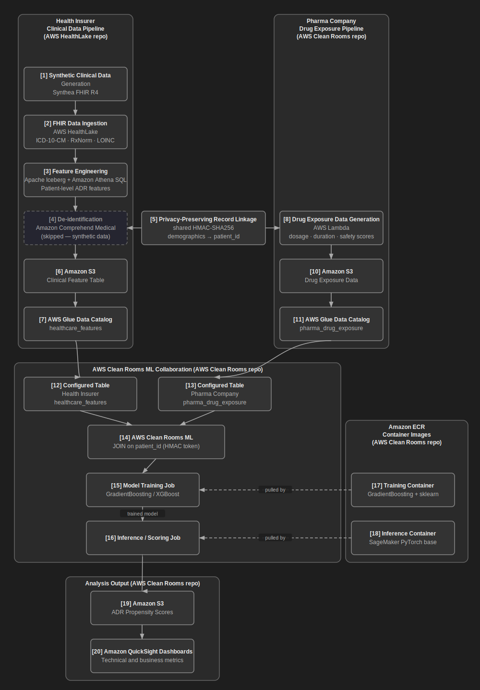
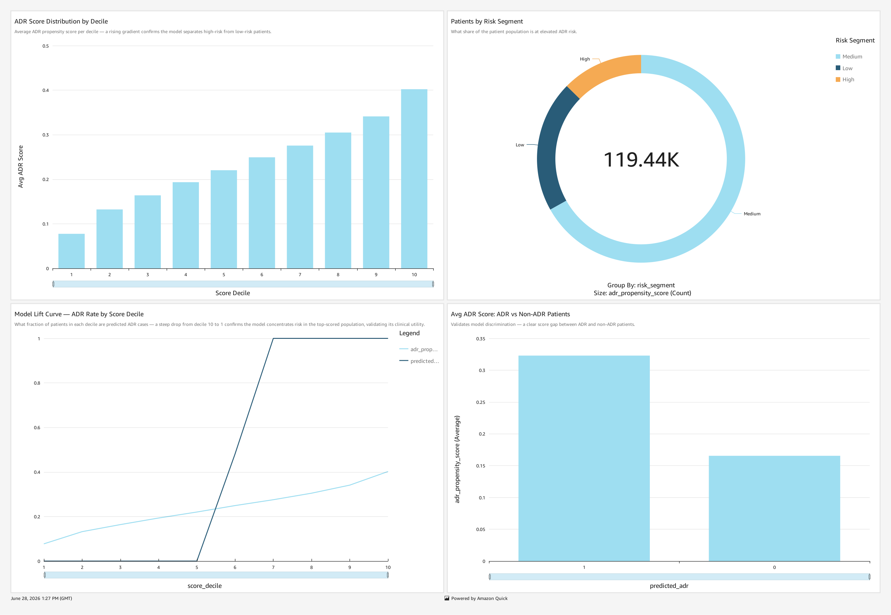
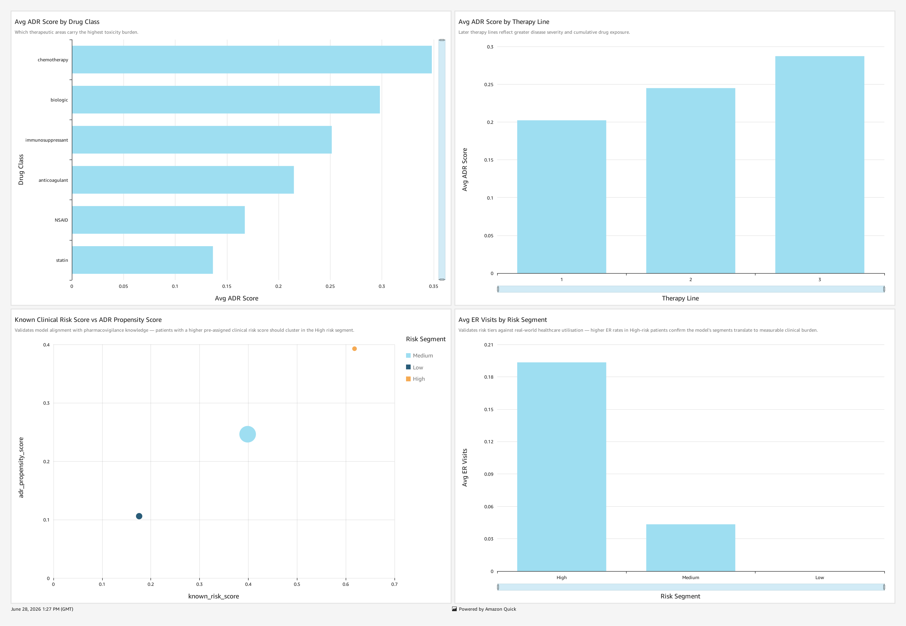
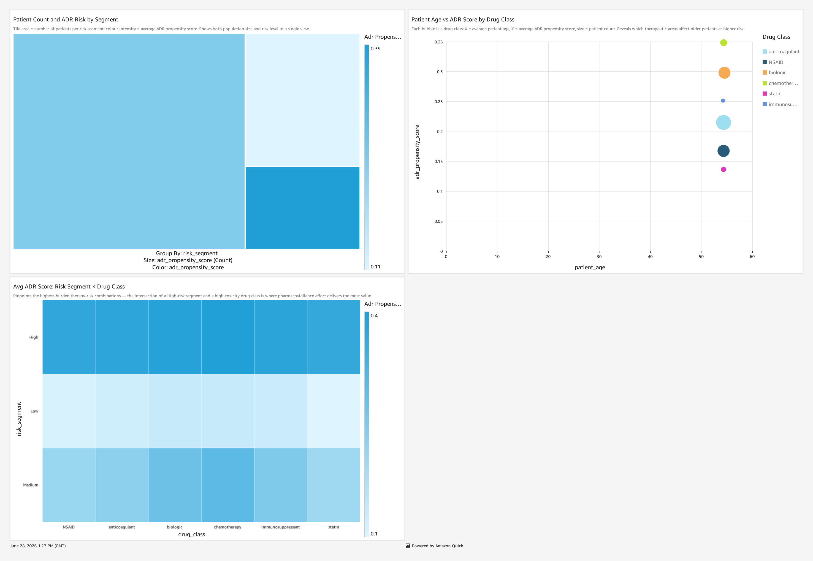
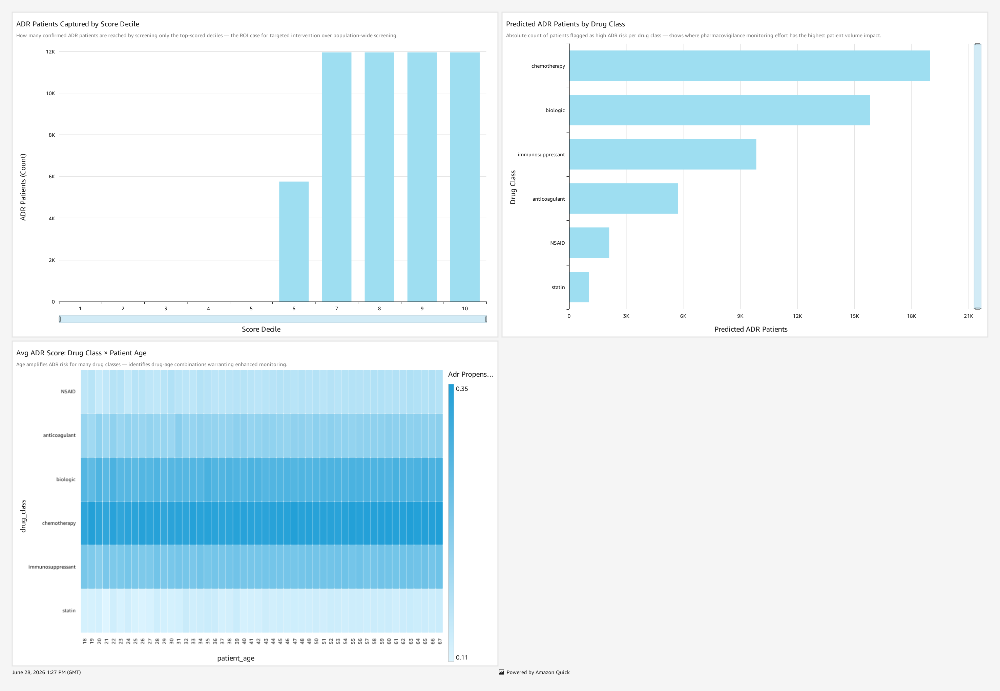
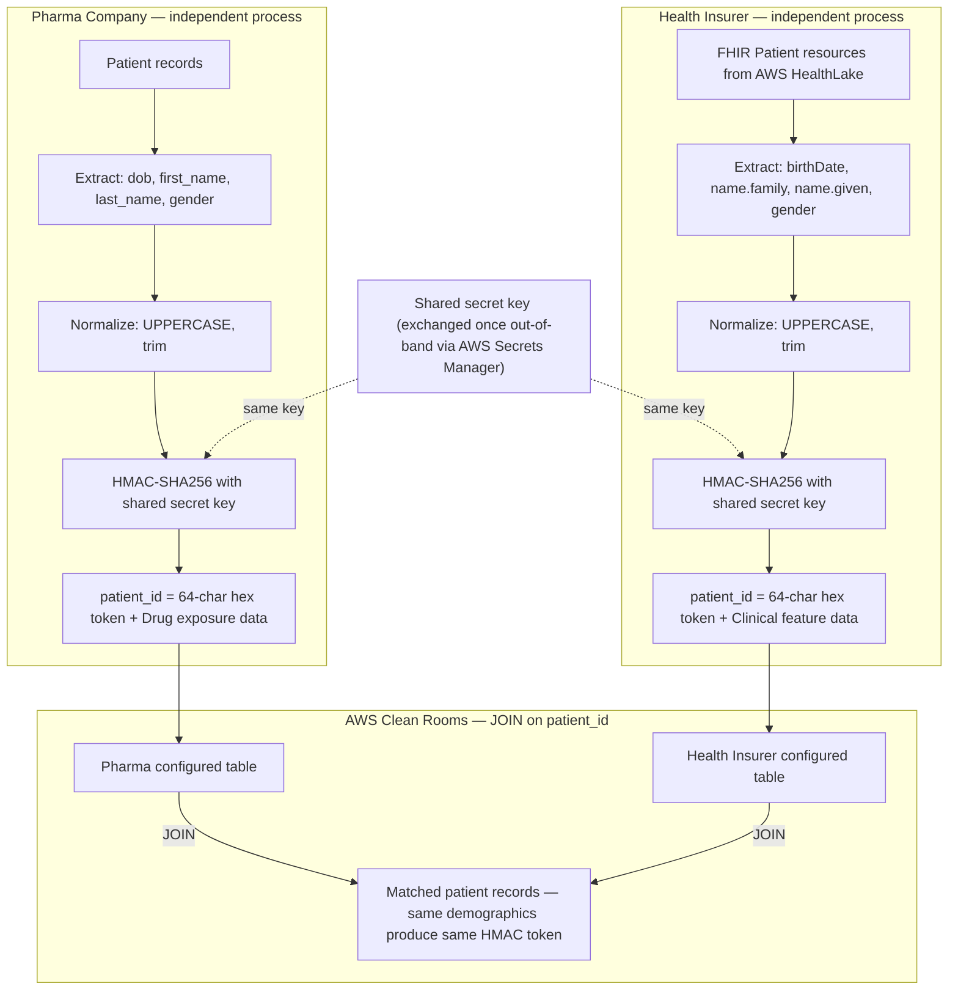
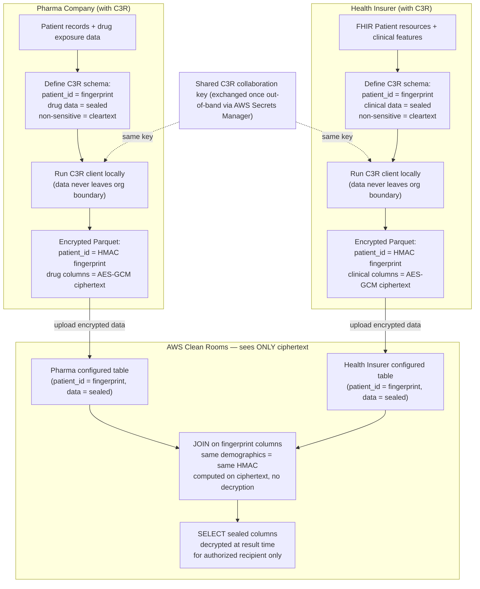

# Adverse Drug Reaction Prediction Combining Pharma, Health Insurer and Clinical Data Using AWS HealthLake and AWS Clean Rooms - Part 1

> **This is an AWS sample provided for demonstration and educational purposes only. It is not intended for production use without modification. See [DISCLAIMER.txt](DISCLAIMER.txt) for full terms.**

---

## Table of Contents

1. [Use Case Overview](#1-use-case-overview)
2. [Architecture](#2-architecture)
3. [Example Dashboards](#3-example-dashboards)
4. [AWS Sample Workflow](#4-aws-sample-workflow)
   - 4.1 [Business Perspective](#41-business-perspective)
   - 4.2 [Patient Matching Across Organizations](#42-patient-matching-across-organizations)
   - 4.3 [Technical Perspective](#43-technical-perspective)
5. [Deployment Guide](#5-deployment-guide)
   - 5.1 [Small or Large Patients Dataset?](#51-small-or-large-patients-dataset)
   - 5.2 [Prerequisites](#52-prerequisites)
   - 5.3 [Step-by-Step Deployment](#53-step-by-step-deployment)
   - 5.4 [What the Custom Resources Do](#54-what-the-custom-resources-do)
6. [Undeployment Guide](#6-undeployment-guide)
7. [Security](#7-security)
8. [Repository Structure](#8-repository-structure)
9. [License](#9-license)

---

## 1. Use Case Overview

### The Problem

Adverse Drug Reactions (ADRs) represent one of healthcare's most significant patient safety challenges. According to [FDA AEMS (formerly FAERS) annual data](https://www.fda.gov/drugs/fdas-adverse-event-reporting-system-faers/reports-received-and-reports-entered-faers-year), millions of adverse event reports are submitted to the FDA each year. According to [FDA AEMS (formerly FAERS) patient outcome data](https://www.fda.gov/drugs/fda-adverse-event-monitoring-system-aems/faers-reporting-patient-outcomes-year), a significant proportion document serious outcomes including hospitalization and death.

The data needed to predict and prevent these events is **fragmented across organizations**:

- Pharmaceutical companies hold drug exposure signals: dosage patterns, treatment duration, known safety profiles, and pharmacovigilance reports, but lack visibility into what happens to patients after they leave clinical trials.
- Health insurers and provider networks hold real-world patient outcome data: emergency visits, hospitalizations, lab results, drug discontinuation events, but lack the drug safety context that pharmaceutical companies possess.

Privacy regulations restrict covered entities from sharing Protected Health Information (PHI) with other parties. In the US, the [HIPAA Privacy Rule (45 CFR §164.502)](https://www.ecfr.gov/current/title-45/subtitle-A/subchapter-C/part-164/subpart-E/section-164.502) (Health Insurance Portability and Accountability Act) prohibits covered entities and their business associates from disclosing PHI, except in specifically defined circumstances. In the EU, [GDPR Article 9](https://eur-lex.europa.eu/legal-content/EN/TXT/?uri=CELEX:32016R0679) (General Data Protection Regulation) prohibits processing of health data as a special category of personal data, with specifically defined exceptions.

### Why ADR Detection Benefits from Cross-Organizational Data

ADR detection is fundamentally a problem of linking **cause** (drug exposure) to **effect** (clinical outcome), and these two halves of the equation reside in different organizations. Without combining them, ADR detection relies on passive voluntary reporting systems like AEMS (formerly FAERS), which suffer from under-reporting and an inability to control for confounding patient factors.

A [2024 systematic review published in *Frontiers in Pharmacology*](https://pmc.ncbi.nlm.nih.gov/articles/PMC11600142/) found that machine learning is being increasingly applied to Electronic Health Record (EHR) data for adverse drug event prediction. A [2024 review published in *Frontiers in Drug Safety and Regulation*](https://www.frontiersin.org/journals/drug-safety-and-regulation/articles/10.3389/fdsfr.2024.1428831/full) found that combining EHR data with other sources has shown benefits for drug safety signal monitoring compared to single-source approaches.

### The Solution

This AWS sample demonstrates how pharmaceutical companies and health insurers (holding both claims and clinical data internally) can apply Machine Learning to their collective dataset, jointly predicting which patients are at highest risk of ADRs without either party ever exposing their raw patient data to the other. 

The end-to-end flow:

**1. Standardize and centralize clinical data (Health Insurer)**

The Health Insurer ingests clinical data (EHR records, claims, lab results) into AWS HealthLake, a HIPAA-eligible Fast Healthcare Interoperability Resources (FHIR) R4 data store, which normalizes everything into a common standard using ICD-10-CM, RxNorm, SNOMED CT, and LOINC coding systems. When patient records arrive from multiple source systems under different identifiers, [AWS Entity Resolution](https://aws.amazon.com/entity-resolution/) identifies and links records belonging to the same patient across disparate sources (matching, merging, and normalizing the data into a single unified patient profile) before feature engineering begins.

**2. Engineer features for Machine Learning (Health Insurer)**

AWS HealthLake automatically transforms the ingested FHIR data into Apache Iceberg tables on Amazon S3, enabling zero-ETL (Extract, Transform, Load) analytics through Amazon Athena SQL; no data movement or separate ETL pipeline required. The Health Insurer runs SQL queries directly on those Iceberg tables (which contain exclusively their own clinical data) to compute patient-level features: Emergency Department (ED) visit counts, hospitalization flags, lab abnormality indicators, drug discontinuation signals, and comorbidity scores. As an alternative to SQL, the [AWS HealthLake MCP server](https://github.com/awslabs/mcp/tree/main/src/healthlake-mcp-server) enables AI agents to interact conversationally with AWS HealthLake data at petabyte scale, computing the same features through natural language queries rather than hand-crafted SQL.

**3. Run Machine Learning analysis on both parties' collective dataset**

Both parties contribute their datasets to an AWS Clean Rooms private collaboration. The datasets are joined using a shared pseudonymized patient identifier. A Machine Learning (ML) model is trained on the combined dataset signals and scores every patient for ADR risk. All this occurs within the privacy boundary of the AWS Clean Rooms collaboration, where neither party can access the other's underlying records.

**4. Act on the results**

The analysis produces an ADR propensity score for every matched patient, together with the contributing risk features from both datasets: drug exposure signals from the pharma side joined with clinical outcomes from the health insurer side. These results are stored in Amazon S3 and visualized in a set of Amazon QuickSight dashboards providing both technical metrics (score distribution, feature importance, model performance) and business metrics (estimated preventable hospitalizations, high-risk patient segments by drug class, therapy line, and comorbidity profile, and projected business impact of early intervention). The resulting dataset can be used for a range of scenarios; for example the pharma company can use it to prioritize safety signal investigations and support regulatory submissions (Risk Evaluation and Mitigation Strategy, REMS). The Health Insurer can use scores to identify high-risk members for targeted outreach through care management programs. Healthcare providers in the insurer's network can embed scores into clinical decision support systems to flag patients during prescribing workflows.

### Collaboration Models


This architecture supports the collaboration of two or more parties. Table below shows, as an example, two-parties and three-parties collaboration model. 
This AWS sample implements the **two-party model** collaboration model.

| Model | Parties | When to use |
|---|---|---|
| **Two-party** | Pharma + Health Insurer | Health Insurer holds both claims and clinical data internally |
| **Three-party** | Pharma + Health Insurer + Hospital/Provider | Clinical notes reside exclusively with providers, separate from the payer |

### Patient Matching

In this sample, patient matching uses a shared pseudonymized identifier derived from patient demographics using HMAC-SHA256 (Hash-based Message Authentication Code with SHA-256), a cryptographic one-way function. Both parties independently compute the same token from agreed demographic fields without sharing raw identifiers. See [section 4.2](#42-patient-matching-across-organizations) for a full explanation.

---

## 2. Architecture



> **Note on box [4]: De-identification**: In this sample, the data is generated by Synthea and contains no real patient information, so this step is skipped. In a production deployment with real patient data, this step would apply Amazon Comprehend Medical PHI (Protected Health Information) detection and masking before the feature table is shared into any collaboration.

---

## 3. Example Dashboards

Once both CloudFormation templates are deployed, the ADR analysis results are presented in four Amazon QuickSight dashboards, providing both business and technical metrics. The first CloudFormation template is provided with this AWS HealthLake AWS Sample and the second is provided with the [AWS Clean Rooms AWS Sample](https://github.com/aws-samples/sample-Adverse-Drug-Reaction-Prediction-Using-AWS-HealthLake-and-AWS-Clean-Rooms-Part2).
---

### Dashboard 1: Score Distribution



| Widget | Description |
|---|---|
| **ADR Score Distribution by Decile** | Bar chart showing average ADR propensity score per score decile (1–10). A rising gradient confirms the model separates high-risk from low-risk patients; the top decile carries significantly higher predicted risk than the bottom. |
| **Patients by Risk Segment** | Donut chart showing what share of the patient population falls in each risk tier (High / Medium / Low), with the total patient count in the center. Provides an immediate view of how risk is distributed across the population. |
| **Model Lift Curve: ADR Rate by Score Decile** | Line chart comparing the actual ADR rate vs. a random baseline across score deciles. A steep drop from decile 10 to 1 confirms the model concentrates risk in the top-scored population, validating its clinical utility. |
| **Avg ADR Score: ADR vs Non-ADR Patients** | Bar chart comparing the average propensity score between patients with a confirmed ADR (predicted\_adr = 1) and those without (predicted\_adr = 0). A clear score gap between the two groups validates model discrimination. |

---

### Dashboard 2: Risk Breakdown



| Widget | Description |
|---|---|
| **Avg ADR Score by Drug Class** | Horizontal bar chart ranking drug classes (chemotherapy, biologic, immunosuppressant, anticoagulant, NSAID, statin) by average ADR propensity score. Identifies which therapeutic areas carry the highest predicted toxicity burden. |
| **Avg ADR Score by Therapy Line** | Bar chart showing how ADR risk increases with therapy line (1st, 2nd, 3rd+). Later therapy lines reflect greater disease severity and cumulative drug exposure, both of which elevate ADR risk. |
| **Known Clinical Risk Score vs ADR Propensity Score** | Scatter plot correlating the pre-assigned clinical risk score (from the pharma dataset) with the model's ADR propensity score, colored by risk segment. Validates model alignment with pharmacovigilance knowledge; patients with higher known risk should cluster in the high risk segment. |
| **Avg ER Visits by Risk Segment** | Bar chart showing average Emergency Department visit count per risk segment (High / Medium / Low). Validates risk tiers against real-world healthcare utilization; higher ER rates in high-risk patients confirm the model's segments translate to measurable clinical burden. |

---

### Dashboard 3: Patient and Drug Analysis



| Widget | Description |
|---|---|
| **Patient Count and ADR Risk by Segment** | Treemap where tile area = number of patients per risk segment and tile color intensity = average ADR propensity score. Shows both population size and risk level in a single view; large dark tiles represent the highest-priority intervention targets. |
| **Patient Age vs ADR Score by Drug Class** | Bubble chart where X = average patient age, Y = average ADR propensity score, and bubble size = patient count per drug class. Reveals which therapeutic areas affect older patients at higher risk, supporting age-stratified safety monitoring. |
| **Avg ADR Score: Risk Segment × Drug Class** | Heat map showing the intersection of risk segment (High / Medium / Low) and drug class. Pinpoints the highest-burden therapy-risk combinations; the intersection of a high-risk segment and a high-toxicity drug class is where pharmacovigilance effort delivers the most value. |

---

### Dashboard 4: Business Impact



| Widget | Description |
|---|---|
| **ADR Patients Captured by Score Decile** | Bar chart showing the count of confirmed ADR patients (predicted\_adr = 1) per score decile. Demonstrates how effectively targeted screening of top-scored deciles captures ADR cases; the ROI case for targeted intervention over population-wide screening. |
| **Predicted ADR Patients by Drug Class** | Horizontal bar chart showing the absolute count of patients flagged as high ADR risk per drug class. Identifies where pharmacovigilance monitoring effort has the highest patient volume impact; chemotherapy and biologics typically lead. |
| **Avg ADR Score: Drug Class × Patient Age** | Heat map showing average ADR propensity score across the intersection of drug class and patient age band. Age amplifies ADR risk for many drug classes; it identifies specific drug-age combinations warranting enhanced clinical monitoring and proactive outreach. |

---

## 4. AWS Sample Workflow

### 4.1 Business Perspective

This section describes what each party does in this AWS sample, from data preparation to analysis results, mapped to the architecture boxes in [section 2](#2-architecture).

#### Resources deployed by the AWS HealthLake CloudFormation template (this repository, boxes [1]–[7])

The Health Insurer's goal is to contribute a clean, standardized, patient-level clinical feature table to the collaboration, without ever exposing raw patient records to the pharma company.

**Box [1]: Synthetic Clinical Data Generation**: Realistic synthetic patient records are generated using [Synthea](https://github.com/synthetichealth/synthea), an open-source synthetic patient generator. Synthea produces FHIR R4 (Fast Healthcare Interoperability Resources, Release 4) formatted records covering patient demographics, encounters, diagnoses, lab observations, and medication prescriptions. In a real-world deployment, this step would be replaced by the Health Insurer's actual clinical data exports from their EHR systems, claims databases, and lab systems.

**Box [2]: FHIR Data Ingestion**: Synthetic FHIR records are ingested into AWS HealthLake, a HIPAA-eligible managed service that stores, transforms, and indexes FHIR R4 data. AWS HealthLake normalizes all clinical codes to standard medical ontologies (ICD-10-CM for diagnoses, RxNorm for medications, LOINC for lab observations), creating a single coherent clinical dataset regardless of the source system format.

**Box [3]: Feature Engineering**: AWS HealthLake automatically exports the ingested FHIR data as Apache Iceberg tables on Amazon S3, enabling SQL analytics directly on the clinical data without any additional data movement. The Health Insurer runs an Amazon Athena SQL query (CTAS: Create Table As Select) that reads five FHIR resource types and computes ten patient-level features that are predictive of ADR risk: ED visit count, hospitalization flag, lab abnormality flag and severity score, drug discontinuation flag and days to discontinuation, comorbidity count, age group, and gender.

**Box [4]: De-identification** *(skipped in this sample)*: In a production deployment, this step would apply Amazon Comprehend Medical PHI (Protected Health Information) detection to ensure that no personally identifiable information is present in the feature table before it enters the collaboration. In this sample the data is synthetic and contains no real patient information, so this step is omitted.

**Box [5]: Patient Token Computation**: Each patient's raw UUID from AWS HealthLake is replaced with a privacy-preserving HMAC-SHA256 token computed from their demographic fields. This token is the shared identifier that allows the pharma company's drug exposure data to be joined with the Health Insurer's clinical features inside AWS Clean Rooms, without either party knowing the other's internal patient identifiers. See [section 4.2](#42-patient-matching-across-organizations) for details.

**Box [6]: Feature Table Storage**: The computed feature table is written to Amazon S3 in Parquet format, with patient identifiers replaced by HMAC-SHA256 tokens. Each row represents one patient and contains the ten clinical features used for ADR risk scoring.

**Box [7]: Feature Table Registration**: The feature table is registered in the AWS Glue Data Catalog, making it queryable and ready to be contributed as a configured table to the AWS Clean Rooms collaboration.

#### Resources deployed by the AWS Clean Rooms CloudFormation template ([Part 2 repository](https://github.com/aws-samples/sample-Adverse-Drug-Reaction-Prediction-Using-AWS-HealthLake-and-AWS-Clean-Rooms-Part2), boxes [8]–[20])

**Box [8]: Synthetic Drug Exposure Data Generation**: An AWS Lambda function generates synthetic drug exposure records for the same patient population, including drug name, dosage, treatment duration, therapy line, known safety scores, and black-box warning flags. Patient tokens are computed from the shared demographics file using the same HMAC-SHA256 key, ensuring that tokens match the Health Insurer's dataset so the Clean Rooms join produces results.

**Boxes [10] and [11]: Drug Data Storage and Registration**: The drug exposure dataset is stored in Amazon S3 and registered in AWS Glue Data Catalog, ready to be contributed as a configured table to the AWS Clean Rooms collaboration.

**Boxes [12] and [13]: Configured Tables and Analysis Rules**: Both parties' Glue-registered tables are added to an AWS Clean Rooms collaboration as configured tables with analysis rules that restrict what queries can be run. Neither party can query the other's raw data; only the defined collaboration queries are permitted.

**Boxes [14], [15], [16]: AWS Clean Rooms ML Training and Inference**: AWS Clean Rooms ML joins both tables on the shared patient token, trains a GradientBoosting model on the combined signal, and runs inference to produce an ADR propensity score for every matched patient. The training and inference containers are pulled from Amazon ECR (boxes [17] and [18]).

**Boxes [19] and [20]: Results and Dashboards**: Scores are written to Amazon S3 and visualized in the Amazon QuickSight dashboards described in [section 3](#3-example-dashboards).

---

### 4.2 Patient Matching Across Organizations

#### The Problem

The pharma company and the Health Insurer each track patients using their own internal identifiers: pharmacy dispensing IDs, clinical trial enrollment numbers, FHIR Patient UUIDs from their EHR systems. These identifiers are organizationally scoped, structurally incompatible, and cannot be shared without exposing raw patient lists.

#### The Solution: Privacy-Preserving Record Linkage (PPRL)

A well-established approach, [used across healthcare research networks](https://pmc.ncbi.nlm.nih.gov/articles/PMC6994009/), is deterministic tokenization using a keyed hash function such as HMAC-SHA256: both organizations independently apply the same cryptographic hash function to the same set of agreed demographic fields using a shared secret key. HMAC (Hash-based Message Authentication Code) is a one-way function: given only the output token, it is computationally infeasible to recover the original demographic values. Patients whose demographics match across the two organizations will produce identical tokens, enabling the join inside AWS Clean Rooms, while neither party ever sees the other's internal patient identifiers or raw demographic data.

The shared secret HMAC key is stored in AWS Secrets Manager. It is **never uploaded to AWS Clean Rooms, never stored in CloudFormation parameters, and never logged**. It is exchanged once between the two parties before data ingestion begins and used consistently across all deployments in the same AWS region.



**Key properties:**
- Neither party ever sees the other's raw patient list or internal identifiers
- The token is non-reversible; knowing the token does not reveal the patient's demographics
- Patients appearing in only one dataset find no match and are silently excluded from the join
- The shared key must be rotated between separate collaborations to prevent cross-collaboration linkage

#### AWS C3R: The Native Implementation

AWS Clean Rooms provides a built-in implementation of this pattern called **C3R (Cryptographic Computing for AWS Clean Rooms)**. With C3R, join columns are designated as fingerprint columns protected using HMAC. Data columns are designated as sealed columns protected using AES-GCM encryption. The key difference from manual pre-hashing: **with C3R, the AWS Clean Rooms service itself never sees the plaintext of any sealed or fingerprint column**, providing a stronger privacy guarantee when a neutral intermediary is involved.



**Key difference vs manual HMAC tokenization**: with C3R, the AWS Clean Rooms service itself never sees plaintext data or patient tokens. With manual HMAC (used in this sample), data is pseudonymized before upload but is plaintext inside AWS Clean Rooms.

---

### 4.3 Technical Perspective

This section describes what each architecture box does at a technical level: what service is used, what it receives as input, and what it produces as output. This covers only the Health Insurer's clinical data pipeline (this AWS HealthLake repo). For the pharma and AWS Clean Rooms components, see the [AWS Clean Rooms repo](https://github.com/aws-samples/sample-Adverse-Drug-Reaction-Prediction-Using-AWS-HealthLake-and-AWS-Clean-Rooms-Part2).

**[1] Synthetic Clinical Data Generation (Synthea)**
AWS CodeBuild runs a Java Synthea process that generates FHIR R4 NDJSON (Newline-Delimited JSON) bulk export files. For the large dataset stack, AWS CodeBuild generates up to 50,000 synthetic patients, each with a full clinical history including encounters, conditions, observations, and medication requests. The output NDJSON files are uploaded to Amazon S3.

**[2] FHIR Data Ingestion (AWS HealthLake)**
A AWS HealthLake `StartFHIRImportJob` call reads the NDJSON files from S3 and imports them into the FHIR datastore. AWS HealthLake validates each resource against the FHIR R4 specification, applies code normalization, and automatically creates Apache Iceberg table representations of each FHIR resource type (Patient, Encounter, Condition, Observation, MedicationRequest) in the AWS Glue Data Catalog. These Iceberg tables are accessible directly via Amazon Athena SQL with no additional data movement. The small dataset stack uses AWS HealthLake's built-in Synthea preload instead of AWS CodeBuild.

**[3] Feature Engineering (Apache Iceberg + Amazon Athena)**
A CTAS (Create Table As Select) SQL query reads five FHIR resource types via the AWS HealthLake AWS Glue resource link database and produces a single Parquet feature table. The SQL logic computes: ED visit counts (emergency-class encounters in a 90-day medication window), hospitalization flag (inpatient encounters in the same window), lab abnormality flag and severity score (LOINC-coded Observation resources with abnormal interpretation codes), drug discontinuation flag and days-to-discontinuation (MedicationRequest resources with status=stopped), comorbidity count (active ICD-10-CM coded Condition resources), and age group and gender from the Patient resource.

**[4] De-identification (Amazon Comprehend Medical)** *(production only, skipped in this sample)*
In production, Amazon Comprehend Medical would scan the feature table for any PHI that may have leaked through the feature computation step and mask or remove it before the table enters the AWS Clean Rooms collaboration. In this sample, Synthea data contains no real patient information and this step is omitted.

**[5] Privacy-Preserving Record Linkage (HMAC-SHA256)**
Before the feature table is ready for AWS Clean Rooms, each patient's raw UUID from AWS HealthLake is replaced with a privacy-preserving HMAC-SHA256 token computed from their demographic fields (date of birth, first name, last name, gender). The shared secret key is stored exclusively in AWS Secrets Manager and never appears in CloudFormation parameters, logs, or environment variables. The pharma company independently computes the same token from the same demographic fields, enabling the join inside AWS Clean Rooms without either party knowing the other's internal patient identifiers. See [section 4.2](#42-patient-matching-across-organizations) for details.

**[6] Feature Table (Amazon S3)**
The CTAS query writes the feature table as Snappy-compressed Parquet files to a dedicated S3 bucket. Each row represents one patient. The table contains eleven columns: patient_id (HMAC-SHA256 token), ed_visit_count, hospitalization_flag, lab_abnormality_flag, lab_severity_score, drug_discontinuation_flag, days_to_discontinuation, comorbidity_count, age_group, and gender.

**[7] Feature Table Registration (AWS Glue Data Catalog)**
The feature table is registered in the AWS Glue Data Catalog as an external Parquet table. AWS Lake Formation grants control access to the table so that only authorized principals (the Lambda execution role and, via AWS Clean Rooms, the collaboration) can query it.

**Infrastructure automation**: Both stacks are fully automated via AWS CloudFormation. The large dataset stack uses an AWS Step Functions state machine to orchestrate the multi-hour pipeline (AWS CodeBuild → AWS HealthLake import → HMAC mapping → CTAS). The CloudFormation stack reaches `CREATE_COMPLETE` in approximately 15 minutes (infrastructure provisioning only); the AWS Step Functions pipeline then runs asynchronously. All pipeline outputs (AWS Glue database name, table name, S3 bucket) are written to AWS Systems Manager (SSM) Parameter Store when the pipeline completes, ready for the AWS Clean Rooms stack to consume.

---

## 5. Deployment Guide

### 5.1 Small or Large Patients Dataset?

This AWS HealthLake repo provides two independent CloudFormation stacks for the Health Insurer's clinical data pipeline. Choose one before you start:

| | **Clinical Data Stack: Small** | **Clinical Data Stack: Large** |
|---|---|---|
| **CloudFormation Template** | [`uc1/healthlake-small-dataset.yaml`](uc1/healthlake-small-dataset.yaml) | [`uc1-scale/healthlake-large-dataset.yaml`](uc1-scale/healthlake-large-dataset.yaml) |
| **Number of Patients** | ~100 patients via AWS HealthLake built-in Synthea preload | 500–50,000 patients via AWS CodeBuild + AWS HealthLake FHIR import |
| **Deployment time** | ~35 min total (all-in-one CFN stack) | from ~1h to ~8h (see table below) |
| **When to use** | Quick end-to-end deployment, useful to review and validate the solution approach, accepting lower analysis result significance in Quicksight dashboards | more representative analysis results, accepting longer deployment time |

**Both stacks are independent and can be deployed simultaneously.** In case you deploy both these patients datasets (large and small), when deploying AWS Clean Rooms repo, you can choose which patients dataset to use (large or small). You can also decide to deploy the AWS Clean Rooms repo twice, one on top of small patients dataset and one on top of large patients dataset.

**PatientCount and pipeline timing (Large stack only):**

| PatientCount | AWS CodeBuild | AWS HealthLake FHIR import | HMAC + CTAS | Total pipeline |
|---|---|---|---|---|
| 500 | ~5 min | ~1–2 h | ~2 min | **~1–2 h** |
| 5,000 | ~10 min | ~2–3 h | ~5 min | **~2–3 h** |
| **50,000** | ~25 min | ~4–6 h | ~10 min | **~5–7 h** |

> The AWS Clean Rooms pharma dataset is generated with a target of approximately 50,000 patients. The AWS Clean Rooms ML join quality, and therefore the significance of the ADR risk scores and dashboard metrics, depends on the number of patients that match across both datasets. Deploying the large stack with 50,000 patients maximizes the overlap with the AWS Clean Rooms ML pharma dataset and produces more meaningful analysis results. Using a higher patient count will make the deployment longer without adding statistical significance, because the matching population is bounded by the AWS Clean Rooms ML dataset size (unless also the AWS Clean Rooms ML pharma dataset is increased). Using a lower count will reduce the number of matched patients and lower the confidence of the model scores.

---

### 5.2 Prerequisites

| Requirement | Notes |
|---|---|
| AWS account | An AWS Account is required to deploy  CloudFormation template and required AWS Services included in this AWS Sample (such as IAM, S3, Lambda, AWS HealthLake, AWS Glue, AWS Lake Formation, Amazon Athena, AWS Step Functions, AWS CodeBuild, SSM, AWS Secrets Manager, Amazon EventBridge) |
| Supported region | This sample can be deployed in any AWS region where all required services, such as AWS HealthLake, AWS Clean Rooms, and Amazon QuickSight, are available. Check the [AWS Regional Services List](https://aws.amazon.com/about-aws/global-infrastructure/regional-product-services/) for AWS Services availability in your target region. |

---

### 5.3 Step-by-Step Deployment

This AWS Sample contains two alternative Cloudformation templates (small patients dataset and large patients dataset).
Step 1, 2, 3 and 5 are common to both (small and large) Cloudformation Templates.
Step 4a explains how to deploy small patients dataset Cloudformation template.
Step 4b explains how to deploy large patients dataset Cloudformation template.

---

#### Step 1: Create an S3 bucket for deployment artifacts

The CloudFormation stack loads Lambda function packages from S3 before deployment. Create a dedicated bucket for these artifacts:

1. Open the [S3 Console](https://s3.console.aws.amazon.com/s3)
2. Click **Create bucket**
3. Enter a bucket name. A name like `healthlake-small-dataset-artifacts` or `healthlake-large-dataset-artifacts` works well, but you can use any name; just ensure it is globally unique and you use the same name in the deployment parameters below.
4. **Enable server-side encryption**: under *Default encryption*, select **SSE-S3 (AES-256)**
5. **Block all public access**: ensure all four *Block Public Access* settings are enabled (they are on by default)
6. Click **Create bucket**

---

#### Step 2: Upload the CloudFormation template

1. In the same S3 bucket, upload the CloudFormation template you intend to deploy:
   - Small stack: `uc1/healthlake-small-dataset.yaml`
   - Large stack: `uc1-scale/healthlake-large-dataset.yaml`
2. After uploading, open the file in S3 and copy the **Object URL**; you will need it in Step 4 or Step 5.

---

#### Step 3: Upload the Lambda deployment packages

Upload the following pre-built zip files from the `dist/` directory of this repository to the S3 bucket you created in Step 1.

```
uc1_hl_waiter_initiator.zip
uc1_hl_waiter_poller.zip
uc1_lf_hl_grant.zip
uc1_bucket_emptier.zip
uc1_hmac_key_manager.zip
uc1_hmac_mapping_initiator.zip
uc1_hmac_mapping_poller.zip
uc1_athena_ctas.zip
uc1_sf_discover_rl.zip
uc1_sf_lf_grant.zip
uc1_sf_check_patient_ready.zip
uc1_sf_submit_hmac_query.zip
uc1_sf_compute_hmac.zip
uc1_sf_ctas_prep.zip
uc1_sf_ctas_grants.zip
uc1_sf_pipeline_starter.zip
```

Upload all files to the root of the S3 bucket (no subfolder). If you prefer a subfolder, note the prefix; you will enter it as the `LambdaAssetsPrefix` Cloudformation parameter in next step.

---

#### Step 4a: Small Patients Dataset CloudFormation deployment

1. Open the [CloudFormation Console](https://console.aws.amazon.com/cloudformation)
2. Click **Create stack** → **With new resources (standard)**
3. Select **Amazon S3 URL** and paste the Object URL of `uc1/healthlake-small-dataset.yaml` from Step 2
4. Click **Next** and fill in the parameters:

| Parameter | Value |
|---|---|
| **Stack name** | Any name you choose, e.g. `ADR-p1-healthlake-small-patients-dataset` |
| `RunId` | A unique identifier for this deployment, e.g. `123456789012-20260624-1430`. Format recommendation: `AccountId-YYYYMMDD-HHMM`. You can use any unique string; this format is a convention to avoid name conflicts, not a requirement. |
| `LambdaAssetsBucket` | Name of the S3 bucket from Step 1 |
| `LambdaAssetsPrefix` | Leave empty if you uploaded zips to the bucket root. Otherwise enter the subfolder prefix with a trailing slash, e.g. `lambdas/` |

5. Click **Next** → **Next**
6. Check **I acknowledge that AWS CloudFormation might create IAM resources with custom names**
7. Click **Submit**

**What to expect**: The stack reaches `CREATE_COMPLETE` in approximately 35 minutes. The longest phase is AWS HealthLake loading the Synthea synthetic dataset (~20–25 min). The `Uc1HlWaiterCustomResource` resource will show `CREATE_IN_PROGRESS` during this phase; this is normal. Once complete, the SSM parameters under `/healthlake-cleanrooms/small-patients-set/` will be populated.

---

#### Step 4b: Large Patients Dataset CloudFormation deployment

1. Open the [CloudFormation Console](https://console.aws.amazon.com/cloudformation)
2. Click **Create stack** → **With new resources (standard)**
3. Select **Amazon S3 URL** and paste the Object URL of `uc1-scale/healthlake-large-dataset.yaml` from Step 2
4. Click **Next** and fill in the parameters:

| Parameter | Value |
|---|---|
| **Stack name** | Any name you choose, e.g. `ADR-p1-healthlake-large-patients-dataset` |
| `RunId` | A unique identifier, e.g. `123456789012-20260624-1500`. Must be different from the small stack RunId if both are deployed. |
| `PatientCount` | Any value between 500 and 50,000. **50,000 is recommended** . See [section 5.1](#51-small-or-large-patients-dataset) for the reasoning. |
| `LambdaAssetsBucket` | Name of the S3 bucket from Step 1 |
| `LambdaAssetsPrefix` | Leave empty or enter subfolder prefix as in Step 4 |

5. Click **Next** → **Next**
6. Check **I acknowledge that AWS CloudFormation might create IAM resources with custom names**
7. Click **Submit**

**What to expect**: The CloudFormation stack reaches `CREATE_COMPLETE` in approximately 15 minutes; this provisions the infrastructure only. The data pipeline then runs asynchronously across two independent AWS Step Functions state machines:

**State Machine 1: Import** (`healthlake-large-import-<RunId>`): runs automatically when CFN completes.

| Stage | Expected duration |
|---|---|
| AWS HealthLake becomes ACTIVE (async waiter) | ~5–10 min (polled automatically every 2 min) |
| AWS CodeBuild generates Synthea data | ~5–25 min depending on PatientCount |
| AWS HealthLake FHIR import | **~1–6 h (the longest stage)** |
| Triggers State Machine 2 | automatic on completion |

**State Machine 2: Processing** (`healthlake-large-processing-<RunId>`): triggered automatically by SM1 when the FHIR import completes.

| Stage | Expected duration |
|---|---|
| Resource link discovery | ~2–5 min |
| AWS Lake Formation grants | ~1 min |
| Patient table readiness check | ~5 min |
| HMAC token computation | ~2–10 min |
| Amazon Athena CTAS feature engineering | ~5–15 min |
| AWS Systems Manager Parameter Store outputs written | <1 min |

> **State Machine 2 (SM2) is independently re-runnable.** If SM2 fails for any reason, you can re-start it directly from the AWS Step Functions console without re-running AWS CodeBuild or the FHIR import. The FHIR data in AWS HealthLake is preserved.

**Monitor pipeline progress**: Optionally, if you want to monitor State Machine progress status, open the [AWS Step Functions Console](https://console.aws.amazon.com/states) and find:
- **AWS Step Functions State Machine 1 (SM1, import)**: state machine named `healthlake-large-import-<RunId>` 
- **AWS Step Functions State Machine 2 (SM2, processing)**: state machine named `healthlake-large-processing-<RunId>` ; starts automatically when SM1 completes.


---

#### Step 5: Next Step

Once Cloudformation template is succesfully deployed, you can proceed deploying the [AWS Clean Rooms repo (Part 2 of this repo)](https://github.com/aws-samples/sample-Adverse-Drug-Reaction-Prediction-Using-AWS-HealthLake-and-AWS-Clean-Rooms-Part2), following its [README deployment instructions](https://github.com/aws-samples/sample-Adverse-Drug-Reaction-Prediction-Using-AWS-HealthLake-and-AWS-Clean-Rooms-Part2/blob/main/README.md).

---

### 5.4 What the Cloudformation Custom Resources Do

Cloudformation templates provided in this AWS Sample use the following Lambda-backed custom resources.

---

**`Uc1HlWaiterCustomResource`: AWS HealthLake Active-Status Waiter** *(small stack only)*

*Why it exists*: CloudFormation marks `AWS::HealthLake::FHIRDatastore` as `CREATE_COMPLETE` as soon as the datastore is registered, while AWS HealthLake is still in `CREATING` state internally loading the Synthea dataset. All downstream resources depend on the datastore being fully `ACTIVE`, and the process takes 20–25 minutes (longer than the maximum Lambda timeout of 15 minutes).

*What it does*: An **initiator** Lambda saves the CloudFormation callback token in SSM Parameter Store and enables an Amazon EventBridge scheduled rule. A **poller** Lambda fires every 2 minutes, calls `DescribeFHIRDatastore`, and when the status is `ACTIVE`, discovers the AWS Glue resource link database auto-created by AWS HealthLake, disables the rule, and signals CloudFormation to continue.

---

**`Uc1LfHlGrantCustomResource`: AWS Lake Formation Grants on the AWS HealthLake Resource Link** *(small stack only)*

*Why it exists*: When AWS HealthLake becomes active it automatically creates a cross-account AWS Glue resource link database pointing to FHIR tables in the AWS HealthLake service account. Granting query access requires two separate `lakeformation:GrantPermissions` calls spanning two AWS account catalogs: the customer account and the AWS HealthLake service account. The native `AWS::LakeFormation::PrincipalPermissions` CloudFormation resource cannot express this two-step cross-catalog pattern.

*What it does*: Makes two AWS Lake Formation grant calls: (1) `DESCRIBE` on the resource link database in the customer account catalog, and (2) `SELECT + DESCRIBE` on all FHIR tables in the AWS HealthLake service account catalog using `TableWildcard`. Together these allow Amazon Athena to read the underlying Iceberg data.

---

**`Uc1AthenaCTASCustomResource`: Amazon Athena Feature Engineering Query** *(small stack only)*

*Why it exists*: The feature table is produced by a one-time SQL query that reads FHIR data and writes a derived Parquet table. CloudFormation has no native resource for executing an Amazon Athena query.

*What it does*: Submits a CTAS query to Amazon Athena. The query reads five FHIR resource types from the AWS HealthLake Iceberg tables and computes ten patient-level ADR features. The result is written as Parquet to the feature S3 bucket and registered in AWS Glue Data Catalog as `healthcare_features`.

**Large stack**: The equivalent operations are handled by the AWS Step Functions pipeline tasks; no custom resources are needed for the feature engineering steps because AWS Step Functions can run long-running async operations that exceed Lambda's 15-minute timeout limit.

---

## 6. Undeployment Guide

**All resources created by each stack are deleted automatically when you delete the stack from CloudFormation.** S3 buckets are emptied automatically before deletion. No manual resource cleanup is required.

If you deployed both the small and large stacks, you can delete them in any order; they are independent.

### Step 1: Delete the AWS Clean Rooms stack (if deployed)

Follow the undeployment instructions in the [AWS Clean Rooms repo README](https://github.com/aws-samples/sample-Adverse-Drug-Reaction-Prediction-Using-AWS-HealthLake-and-AWS-Clean-Rooms-Part2/blob/main/README.md).

### Step 2: Delete the AWS Healthlake stact (small/large patients dataset)

In the [CloudFormation Console](https://console.aws.amazon.com/cloudformation), select the stack → **Delete**. Repeat for each deployed stack (small and/or large).

CloudFormation will automatically remove all resources: AWS HealthLake datastore, S3 buckets, Lambda functions, IAM roles, AWS Step Functions state machines, AWS Glue databases, Amazon Athena workgroups, AWS Lake Formation settings, SSM parameters, Amazon EventBridge rules, and AWS Secrets Manager keys.

---

## 7. Security

- No raw patient data is shared between parties at any point. The HMAC patient token is a one-way pseudonym; knowing it does not reveal the patient's identity.
- All data stored at rest is encrypted: AWS HealthLake datastores use AWS_OWNED_KMS_KEY encryption, S3 buckets use AES-256 server-side encryption (SSE-S3), and Amazon Athena query results use SSE-S3.
- All S3 buckets enforce HTTPS (`aws:SecureTransport: true`) and block all public access.
- IAM roles follow least-privilege. No wildcard resource ARNs are used except where AWS does not support resource-level restrictions, specifically `lakeformation:GrantPermissions`, `RevokePermissions`, `ListPermissions`, `PutDataLakeSettings`, `GetDataAccess`, `RegisterResource`, `DeregisterResource` and all X-Ray actions, which cannot be scoped to a resource ARN per the [AWS Service Authorization Reference](https://docs.aws.amazon.com/service-authorization/latest/reference/list_awslakeformation.html). AWS Step Functions log delivery actions also require `Resource: "*"` per the [AWS Step Functions CloudWatch Logs documentation](https://docs.aws.amazon.com/step-functions/latest/dg/cw-logs.html). Each wildcard statement is documented inline in the template with the corresponding reference.
- The AWS HealthLake cross-account AWS Glue resource link requires `Resource: "*"` for AWS Glue read actions because the AWS HealthLake service account catalog ID is discovered at pipeline runtime and cannot be statically scoped in the CloudFormation template at deploy time.
- The HMAC shared secret key is stored exclusively in AWS Secrets Manager. It is never stored in CloudFormation parameters, environment variables, S3 objects, or logs.

See [SECURITY.md](SECURITY.md) for the full security disclosure and responsible disclosure policy.

---

## 8. Repository Structure

```
.
├── uc1/
│   └── healthlake-small-dataset.yaml  # Clinical Data Stack (Small) — HealthLake Synthea preload, ~100 patients, ~35 min
├── uc1-scale/
│   └── healthlake-large-dataset.yaml  # Clinical Data Stack (Large) — Step Functions pipeline, 500–50,000 patients
├── lambda/
│   │
│   │  # Small stack Lambdas (CloudFormation custom resources)
│   ├── uc1_hl_waiter_initiator/   # HealthLake ACTIVE waiter — async initiator
│   ├── uc1_hl_waiter_poller/      # HealthLake ACTIVE waiter — EventBridge poller
│   ├── uc1_lf_hl_grant/           # Lake Formation grants on HealthLake resource link
│   ├── uc1_hmac_mapping_initiator/ # HMAC token mapping — async initiator
│   ├── uc1_hmac_mapping_poller/   # HMAC token mapping — EventBridge poller
│   ├── uc1_athena_ctas/           # Athena CTAS feature engineering
│   │   └── sql/feature_engineering.sql
│   │
│   │  # Shared (both stacks)
│   ├── uc1_bucket_emptier/        # S3 bucket auto-emptier on stack deletion
│   ├── uc1_hmac_key_manager/      # Shared HMAC key: create-if-not-exists in Secrets Manager
│   │
│   │  # Large stack Step Functions task Lambdas
│   ├── uc1_sf_discover_rl/        # Discover HealthLake Glue resource link database
│   ├── uc1_sf_lf_grant/           # Lake Formation grants (Step Functions task)
│   ├── uc1_sf_check_patient_ready/ # Poll until patient Iceberg table has rows
│   ├── uc1_sf_submit_hmac_query/  # Submit Athena demographics SELECT query
│   ├── uc1_sf_compute_hmac/       # Paginate results, compute HMAC tokens, upload CSVs
│   ├── uc1_sf_ctas_prep/          # Drop old table, clean S3, submit CTAS query
│   │   └── sql/feature_engineering.sql
│   ├── uc1_sf_ctas_grants/        # Post-CTAS Lake Formation grants
│   └── uc1_sf_pipeline_starter/   # CFN custom resource: starts Step Functions execution
├── dist/
│   ├── package_lambdas.py         # Packages all Lambda zips for upload
│   └── deploy_stacks.py           # Deploy/delete stacks via boto3 (developer use)
└── README.md
```

---

## 9. License

This library is licensed under the MIT-0 License. See the [LICENSE](LICENSE) file.
